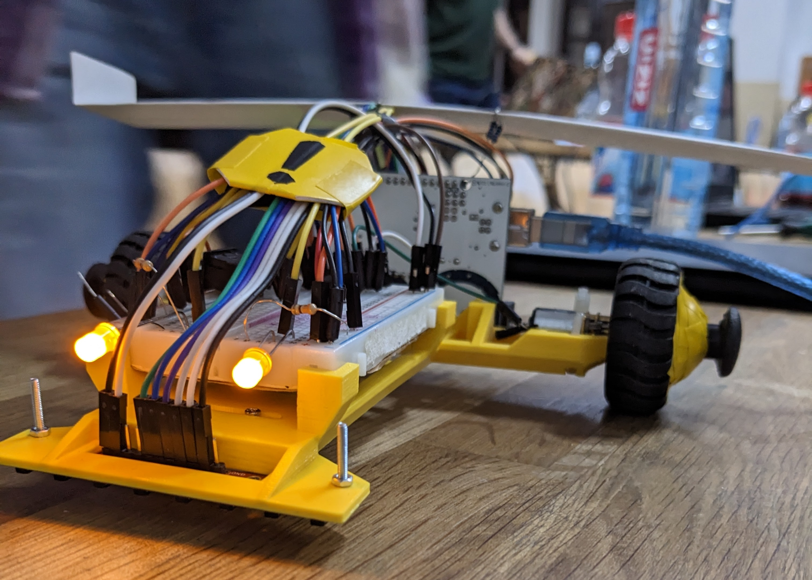
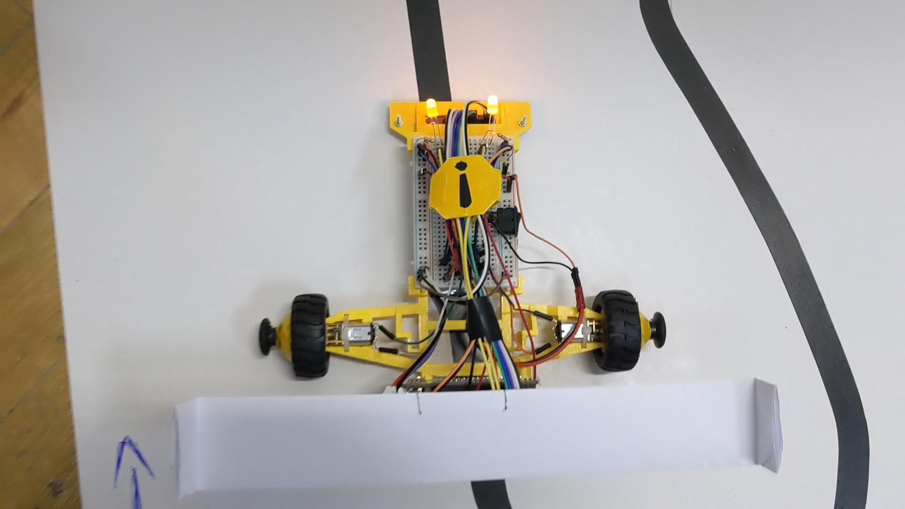

<body>
<h1 align="center">Line Follower - Introduction to Robotics Project</h1>
  

 
&emsp;   This is a car-like robot that is designed to follow a a line or path using a reflectance sensor array, keeping the line under the middle sensors. The goal is to move on the line to complete a circuit as fast as possible. T

<h3>&emsp; Context:</h3>

&emsp; -Team of 2 at "Introduction to Robotics" course 
 
&emsp; -Received a kit, assembled it and programmed it 
 
&emsp; -Had to finish the circuit in less than 20 seconds.

 
  
&emsp; The array of reflectance sensors is placed on the bottom of the robot and is used to detect the contrast between the line and the surrounding surface. The sensors send signals to the control system, which uses this information to calculate the position of the robot on the line.

 
 
&emsp;The robot is equipped with 2 DC motors, one for each wheel, which are used to control the movement of the robot. The control system uses the information from the sensors to determine the direction and speed of the motors, in order to keep the robot moving along the line.

 
 
&emsp;The robot can adjust its speed and direction by using <b>PID</b> algorithm to minimize the error between the desired setpoint and the current position of the robot on the line. By combining the data from the sensors with the power of the DC motors, the robot is able to stay on the line and navigate through a course.

 
 
&emsp; <b>PID</b> is a control loop feedback mechanism that calculates an error value as the difference between a desired setpoint (e.g. the center of a line) and the current process variable (e.g. the position of the robot on the line). The PID algorithm then uses this error value to calculate and adjust the control variable (e.g. the robot's speed and direction) in order to minimize the error and bring the process variable closer to the setpoint. The "P" in PID stands for proportional, which means that the control variable is adjusted proportionally to the error. The "I" stands for integral, which accounts for accumulated error over time. The "D" stands for derivative, which accounts for the rate of change of the error. These three components work together to provide precise control and stability in the system

 
   
&emsp; The assembly guide for this project can be found <a href="assets/Line Follower Assembly Guide (2022 - 2023) v1.04.pdf" class="image fit" >here</a> and there is a <a href=https://youtu.be/BGlGArzXqzE>link</a> to a video where the robot completes the challenge.

 

  
  
 

 
 <h3>&emsp; Components used for this project are</h3>
 <ol>
  <li>Arduino Uno</li>   
  <li>Zip-ties  </li>
  <li>Power source (can be of different shape). In our case, a LiPo battery  </li>
  <li>Wheels (2)  </li>
  <li>Wires for the line sensor (female - male)  </li>
  <li>QTR-8A reflectance sensor, along with screws  </li>
  <li>Ball caster  </li>
  <li>Extra wires  </li>
  <li>Chassis  </li>
  <li>Breadboard - medium (400pts)  </li>
  <li>L293D motor driver  </li>
  <li>DC motors (2)</li>
 </ol>

</body>
